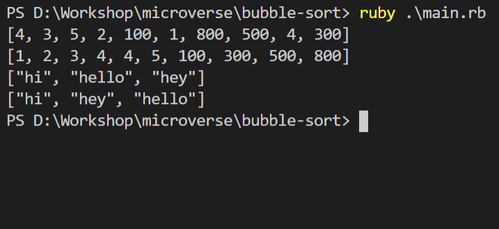

## Week 5

# Project 1 - Ruby : Bubble sort

## Screen Shot

- In this project, we used loops to develop the algorithm for the bubble_sort method.

- Yield statement has been implemented in the bubble_sort_by algorithm alongside the use of while loop.

- You can find the original project specification at: https://www.theodinproject.com/courses/ruby-programming/lessons/bubble-sort

## Built With

- Ruby

## Getting Started

Follow these steps to get a local copy up and running :

1. Install `git` on your local machine.
1. Type `git init` in the Terminal.
1. Clone the repository to your local machine `git clone https://github.com/od-c0d3r/bubble-sort.git`.
1. Cd into the repository `cd bubble-sort`.
1. Open the `main.rb` file and run it with your editor, or excute the file using ruby runtime `ruby main.rb`

## Authors

**Wandji Bertrand**

- GitHub: [@Wandji20](https://github.com/wandji20)

**Omar Rashad**

- GitHub: [@od-c0d3r](https://github.com/od-c0d3r)

## Contributing

Contributions, issues, and feature requests are welcome!

## Show your support

Give a star if you like this project!
